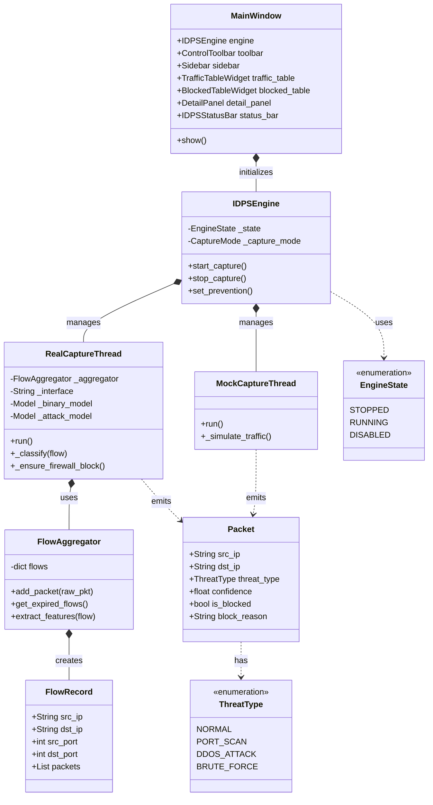
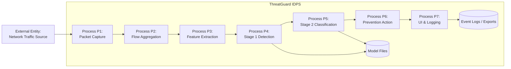
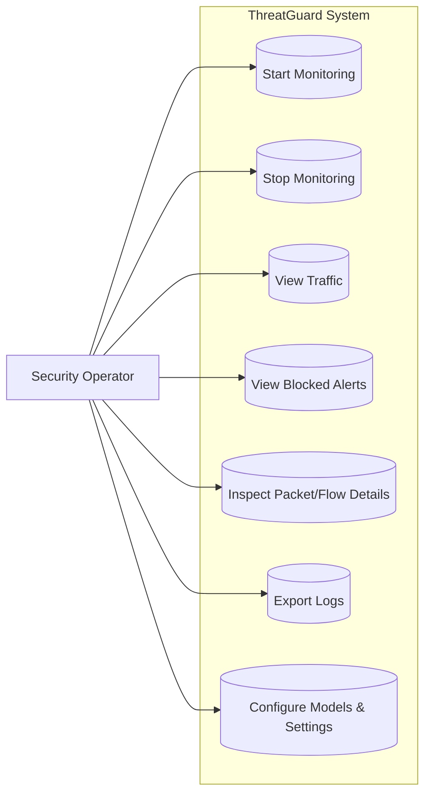
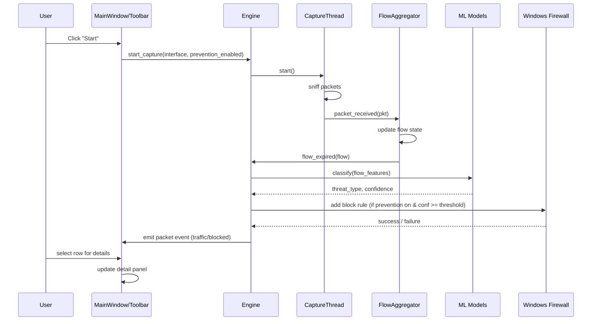

# Project Report Information — ThreatGuard IDPS

This file maps your institute’s report structure (as in the screenshot) to concrete, ThreatGuard-specific content you can expand into full chapters. For each heading, you can convert the bullets into 1–2 paragraphs in your final report.

---

## Chapter 1: Introduction (Pages 1–3)

### 1.1 Brief Description of the Organization

Customize this to your institute or hosting organization. Typical points:

- Name and location of the institute/organization where the project is carried out
- Type of organization (academic department, security lab, or partner company)
- Key activities: teaching, research, software development, or IT/security services
- Motivation for taking up a cybersecurity/IDPS project within this organization

### 1.2 General Description of the System

ThreatGuard: Machine Learning Based Intrusion Detection and Prevention System (IDPS) for real-time network traffic monitoring.

Key points to cover:

- Desktop-based Windows application providing live network monitoring and host-level protection
- Uses Scapy to capture network packets from selected interfaces in real time
- Aggregates packets into flows, extracts numerical features, and applies a two-stage ML pipeline
- Stage 1: binary classifier (normal vs attack), Stage 2: multi-class attack classifier
- Applies host firewall rules to block malicious sources when confidence thresholds are met
- Presents a PySide6-based dashboard showing all traffic, blocked alerts, statistics, and packet/flow details

### 1.3 Need for the System

- Traditional tools (Wireshark, raw packet captures) require expert manual analysis and are reactive
- Organizations often lack an integrated, real-time desktop tool that goes from capture to automated action
- Increasing frequency of scans, botnets, and brute-force attacks against internet-exposed hosts
- Need for:
  - continuous local monitoring
  - automated ML-based decision support
  - immediate host-level blocking
  - operator-friendly visualization and logging

### 1.4 Objectives of the System

You can state objectives as:

- To design and implement a desktop-based IDPS capable of real-time packet capture on Windows
- To build a two-stage ML pipeline for malicious detection and attack-type classification
- To integrate host-level prevention using Windows Firewall rules
- To provide separate views for all traffic and blocked events, with detailed drill-down
- To minimize false positives using confidence thresholds and tuned detection policies
- To reduce alert flooding by de-duplicating blocked events within a cooldown window

### 1.5 Methodology

- Followed an iterative SDLC:
  - requirement analysis based on security use-cases and institute guidelines
  - architecture and module design for capture, ML, UI, and prevention layers
  - incremental implementation with regular integration testing
  - tuning of detection thresholds and behavioral logic using controlled traffic
  - UI refinements based on usability and clarity of alerts
- Data-driven approach:
  - offline model training and evaluation using labeled CICIDS datasets
  - online validation using synthetic and real network traffic

### 1.6 Data Requirements & Collection Methods

Data types involved:

- Runtime data:
  - live packets captured from the selected network interface using Scapy
  - derived flow records with statistical features (e.g., packet counts, IATs, flag counters)
- Model artifacts:
  - pre-trained Stage 1 and Stage 2 models
  - scaler
  - label encoder
  - feature name metadata
- Validation data:
  - controlled traffic from a secondary host/VM using tools like nmap and hping3

Collection methods:

- Use Scapy-based capture to collect packets directly from NIC
- Aggregate packets into flows based on 5-tuple fields
- Compute numerical features consistent with training features
- Store trained models in the project’s model directory and load them at runtime

---

## Chapter 2: System Analysis (Pages 4–7)

### 2.1 Existing System & Limitations

Existing situation:

- Use of standalone tools (tcpdump/Wireshark) for capture and separate scripts for analysis
- Manual, time-consuming review of logs to identify suspicious traffic
- Signature-only IDS/IPS that struggle with new or obfuscated attacks

Limitations:

- Delayed detection and response; no real-time automatic blocking
- Operator overload from large volumes of raw packets/alerts
- Lack of unified dashboard combining capture, ML, and prevention
- Difficulty correlating multiple sources of information on a single host

### 2.2 Proposed System & Intended Objectives

Proposed system (ThreatGuard):

- Unified desktop application for:
  - capturing traffic
  - performing ML-based detection
  - applying prevention
  - visualizing results
- Incorporates two-stage ML inference to identify both maliciousness and attack type
- Provides a clear UI for all traffic, blocked events, and detailed packet/flow context
- Supports both live capture and mock/simulation mode for lab demonstration

Intended objectives:

- Reduce manual effort required to detect and block common network attacks
- Improve accuracy and consistency of detection using pre-trained ML models
- Provide justifications (confidence scores, model used, block reason) for each action
- Maintain a manageable blocked-event view through alert de-duplication

### 2.3 Feasibility Study (Technical, Operational, Economic)

Technical feasibility:

- Implemented in Python using established libraries (PySide6, Scapy, scikit-learn, XGBoost ecosystem)
- Windows platform with Npcap/WinPcap for packet capture and built-in Windows Firewall for blocking
- Modular architecture with clear separation between UI, engine, capture, ML, and prevention

Operational feasibility:

- Simple GUI controls (start/stop, interface selection, prevention toggle)
- Visual statistics and tables reduce the expertise needed to interpret events
- Logging and export features support reporting and troubleshooting

Economic feasibility:

- Uses open-source libraries and free tools
- No license cost for runtime components
- Hardware requirements are moderate (standard multi-core CPU, 8–16 GB RAM)

---

## Chapter 3: System Requirement Analysis (Pages 8–11)

### 3.1 Requirement Analysis

- Identify key stakeholders:
  - security operator/system administrator
  - developer/maintainer
  - end-user requiring local host protection
- Analyze use-cases:
  - monitor local host traffic
  - detect port scans, brute-force attempts, and DoS-like behavior
  - block malicious IPs
  - export evidence for reporting

### 3.2 Functional Requirements

Core functions:

- Start and stop live packet capture
- Select active network interface
- Aggregate packets into flows and compute features
- Run Stage 1 and Stage 2 ML models on flows
- Show all traffic and flagged threats in a main table
- Maintain a separate blocked-alert table
- Apply/disable host-level prevention based on user toggle
- Display detailed metadata for selected events (threat type, confidence, model, reason)
- Export traffic and blocked logs to files

### 3.3 Non-Functional Requirements

- Real-time responsiveness of capture and UI updates
- Reliable ML inference without crashes or inconsistent behavior
- Low false-positive rate in normal operation
- Clear visual traceability for every blocked event
- Maintainability through modular code and documented model assets
- Security best practices (no storage of sensitive secrets, safe firewall command usage)

### 3.4 Hardware Requirements

- CPU: modern multi-core processor
- RAM: minimum 8 GB (16 GB recommended during heavy capture or testing)
- Storage: SSD with sufficient space for logs and models
- Network: at least one active interface capable of packet capture

### 3.5 Software Requirements

- Operating system: Windows with administrator privileges
- Python and required dependencies (as per `requirements.txt`)
- Npcap/WinPcap installed to support Scapy packet capture
- Optional tools for test traffic generation on a separate machine (nmap, hping3, etc.)

### 3.6 Data Requirements

- Model input:
  - numerical flow features extracted at runtime
  - features consistent with the training feature names and order
- Model artifacts:
  - trained Stage 1 and Stage 2 models
  - scaler and label encoder
  - feature name metadata
- Test data:
  - live or synthetic traffic traces that cover both benign and malicious scenarios

---

## Chapter 4: System Design (Pages 12–17)

### 4.1 System Architecture

Describe the layered architecture:

- Presentation Layer (PySide6 UI)
- Control Layer (engine, state machine, signal routing)
- Capture and Feature Layer (Scapy capture, flow aggregation, feature extraction)
- ML Inference Layer (two-stage models, confidence handling, compatibility mapping)
- Prevention Layer (firewall rule management)
- Persistence/Export Layer (log export utilities)

### 4.2 Component Design

Key components:

- Main window:
  - sets up split views for traffic and blocked tables
  - integrates toolbar, sidebar, status bar, and detail panel
- Engine:
  - manages capture mode (real/mock)
  - auto-discovers and loads models, scaler, and feature metadata
  - tracks statistics and emits signals to UI
- Capture threads:
  - real capture thread using Scapy
  - mock capture for demonstration/testing
- Flow aggregator:
  - maintains flow state
  - determines flow expiration and triggers ML inference
- Prevention manager:
  - ensures firewall rules are added only for valid, routable IPs
  - avoids duplicate rules for the same source

### 4.3 Execution Flow

Typical execution:

1. User launches ThreatGuard as administrator
2. User selects network interface and starts monitoring
3. Scapy captures packets and passes them to the flow aggregator
4. Flow aggregator builds/upgrades flow records and determines when to infer
5. Real-time thread computes features and calls Stage 1 and Stage 2 models
6. Engine determines if traffic is malicious, computes confidence, and decides on blocking
7. UI updates:
   - traffic table for all events
   - blocked table for new blocked alerts (de-duplicated)
   - detail panel for selected packet/flow
8. User can stop monitoring or export logs at any time

---

## Chapter 5: System Development (Pages 18–20)

### 5.1 Introduction

Briefly explain that this chapter covers how the system was built from the design:

- choice of technology stack
- setup of the development environment
- coding conventions and modularization

### 5.2 Development Environment

- Language and libraries:
  - Python for core logic
  - PySide6 for GUI
  - Scapy for packet capture
  - scikit-learn/XGBoost ecosystem for ML models
- Tools:
  - IDE for development (e.g., VS Code/Trae)
  - virtual environment for dependency management
- Target OS:
  - Windows with Npcap/WinPcap for capture and built-in firewall for blocking

### 5.3 Development Methodology

- Iterative and incremental development:
  - prototype basic capture and UI
  - integrate ML inference with offline test data
  - add prevention and blocked-table logic
  - refine detection thresholds and behavioral heuristics
- Continuous testing using:
  - unit-like checks of model loading and feature processing
  - manual scenarios with known attack patterns

### 5.4 Major Development Stages

- Stage 1:
  - initial UI skeleton and basic packet capture
- Stage 2:
  - flow aggregation, feature computation, and initial ML integration
- Stage 3:
  - Windows firewall blocking and prevention-toggle wiring
- Stage 4:
  - behavioral scan assist, deduplication of blocked alerts
- Stage 5:
  - documentation, deployment guide, and dissertation alignment

---

## Chapter 6: System Testing (Pages 21–23)

### 6.1 Introduction to Testing

- Objective: verify that ThreatGuard correctly detects and classifies attacks while minimizing false positives
- Types of testing:
  - module-level validation (engine, models, exporter)
  - end-to-end runtime testing (capture → detect → block → display)

### 6.2 Testing Methodology

- Use of both synthetic and real network traffic:
  - simulated attack-like flows for unit-style tests
  - real tools such as nmap and hping3 for behavioral tests
- Repeated experiments:
  - vary ports, scan speeds, and traffic patterns
  - test both with and without prevention enabled

### 6.3 Test Environment

- Testbed:
  - one Windows host running ThreatGuard
  - one or more additional hosts/VMs generating traffic
- Configuration:
  - Npcap installed on the monitoring host
  - controlled LAN or virtual network to avoid impact on production networks

### 6.4 Module-wise Testing

Examples:

- Engine:
  - verify model auto-discovery and proper fallback between model bundles
  - verify statistics counters and state transitions
- Capture and feature modules:
  - validate that flow construction and feature extraction work for both TCP and UDP
- ML modules:
  - verify model loading and prediction with sample feature vectors
- Prevention:
  - confirm that firewall rules are added for malicious IPs and not for invalid/loopback IPs
- UI:
  - ensure traffic and blocked tables line up with internal packet events

Include pass/fail summaries and observations in the final report.

---

## Chapter 7: System Implementation (Pages 24–66)

### 7.1 Introduction

- Explain that this chapter presents how the design was realized in code
- Mention that only core snippets are shown in the report; complete code is attached separately or referenced

### 7.2 Implementation Environment

- Hardware: configuration of the developer/test machine
- Software:
  - OS version (e.g., Windows 10/11)
  - Python version used
  - versions of PySide6, Scapy, scikit-learn, XGBoost (if required by your guidelines)
  - Npcap/WinPcap version

### 7.3 GUI Implementation

Points to cover:

- Layout design:
  - two main tables (traffic and blocked)
  - sidebar with statistics
  - toolbar with start/stop, interface selection, and prevention toggle
  - detail panel showing headers, threat meta-data, and confidence bar
- Navigation:
  - selecting rows updates the detail panel
  - menu or toolbar actions to export logs
- Visual cues:
  - color coding for blocked vs normal traffic
  - confidence bar and labels

### 7.4 Orchestration Layer Implementation

Describe the orchestration logic:

- Engine:
  - manages capture threads and state (running, stopped, disabled)
  - updates statistics and emits signals
- Real capture:
  - resolves interface names, starts Scapy sniffing, and handles packet callbacks
  - records per-source activity for behavioral scan detection
- Blocked-event handling:
  - implements deduplication window by `(source_ip + threat_type)`
  - separates detection confidence from block decision thresholds

### 7.5 Code Snippets

For the final report you can include selected, readable code snippets such as:

- simplified main function showing admin check and window creation
- a representative function that classifies a flow and computes confidence
- snippet responsible for adding a firewall rule
- snippet that updates the blocked table and detail panel

Ensure any long code listings are moved to appendices if your guidelines require.

### 7.7 Project Output

Summarize tangible outputs:

- Working ThreatGuard desktop application
- Screenshots:
  - main dashboard with live traffic
  - blocked table showing detected attacks
  - detail panel with confidence and block reason
- Logs and export files demonstrating detected port scans or other attacks
- Evaluation statistics and metric summaries

---

## Suggested Diagrams (For Your Report)

### How to ask an AI to generate or modify this Class Diagram
If you want to use ChatGPT, Claude, or another AI to generate this diagram in a different style (like PlantUML) or tweak it for your report, use this human-like prompt:

> "Hey! I'm working on my MCA dissertation report for a project called 'ThreatGuard'. It's a desktop-based Intrusion Detection and Prevention System (IDPS) that I built using Python, PySide6, Scapy, and scikit-learn/XGBoost.
> 
> I need a Class Diagram for my project report. Can you create one for me? Here is how my code is structured:
> 
> First, there's the UI layer. The main class is `MainWindow`, and it contains all the UI widgets like `ControlToolbar`, `Sidebar`, `TrafficTableWidget`, `BlockedTableWidget`, `DetailPanel`, and `IDPSStatusBar`. It also initializes the core engine.
> 
> Second, there's the control layer. The `IDPSEngine` class is the boss here. It manages states (using the `EngineState` enum) and decides if we are doing real capture or mock capture (using the `CaptureMode` enum). It's responsible for starting and stopping the capture threads and handling the prevention rules.
> 
> Third, the capture threads. `IDPSEngine` manages two types of threads: `RealCaptureThread` and `MockCaptureThread`. The `RealCaptureThread` is the heavy lifter—it uses a `FlowAggregator` class to build flows, classifies them using ML models, and blocks IPs if needed.
> 
> Finally, the data models. The `FlowAggregator` creates `FlowRecord` objects (which hold things like src_ip, dst_ip, and ports). Both capture threads emit `Packet` objects, which store the final results like `threat_type` (from the `ThreatType` enum), `confidence`, and `block_reason`.
> 
> Could you generate a Mermaid.js class diagram for me that shows these classes, their attributes/methods, and how they connect to each other? Please make sure to show composition (like MainWindow owning the UI widgets) and dependencies (like threads emitting packets)."

---

You can copy these Mermaid code blocks into [Mermaid Live Editor](https://mermaid.live/) to generate high-quality PNG/SVG images for your report, or use them as a reference to draw your own in Draw.io or Microsoft Word.

### System Class Diagram



---

## Conclusion, Limitations, and Future Scope (Pages 67–68)

### Conclusion

- ThreatGuard successfully demonstrates that a desktop-based ML-powered IDPS can:
  - capture live traffic
  - detect and classify attacks using a two-stage ML pipeline
  - apply host-level prevention through Windows Firewall
  - present results through a practical operator dashboard
- The project bridges theoretical ML-based intrusion detection and real-world host defense.

### Limitations of the Project

- Host-centric only; does not provide distributed or multi-node deployment
- Windows-specific prevention (firewall commands are not portable to other OSs)
- Requires administrator privileges for core functionality (capture and blocking)
- Model performance depends on how closely runtime traffic matches training distributions
- No integrated online retraining loop; model updates are offline processes

### Future Scope

- Extend to multi-host/SOC-style deployment with centralized logging and alerting
- Add policy profiles (strict, balanced, custom) to tune sensitivity
- Integrate with SIEM tools and external alerting channels (e-mail, messaging)
- Implement retraining pipelines and feedback loops based on real-world traffic
- Add more advanced analytics and visualization dashboards

---

## References (Pages 69–70)

Use the style (IEEE/APA) specified by your department. Typical references for this project include:

- textbooks on network security and intrusion detection
- documentation for:
  - Scapy
  - PySide6/Qt
  - scikit-learn
  - XGBoost
- research papers or benchmark descriptions for datasets such as CICIDS2017

You can reuse and formalize the reference list already drafted in your dissertation file, ensuring consistent citation style throughout the report.

---

## Latest Implementation Note: IP Manager

The current ThreatGuard implementation includes a simplified IP Manager that acts as a local firewall control panel. It shows captured/scanned IPs, current ThreatGuard firewall state, and pending operator decisions. The operator can stage a selected IP as blocked or allowed, then use Apply Changes to update Windows Firewall.

The traffic tables also support right-click single-IP actions. If an IP is already blocked, the context action allows it; otherwise, the action blocks it. Reset All clears saved allow/block lists and removes ThreatGuard-managed firewall block rules.

Attack families described in the report can include Port Scan/probing, DoS, DDoS, SSH/FTP brute force, Bot/Malware/C2-like communication, data exfiltration or infiltration, DNS tunneling, ARP spoofing, SQL injection, and XSS-style web attacks depending on the active model output.

---

## Suggested Diagrams (For Your Report)

You can generate diagrams from these definitions using any Mermaid-compatible tool (for example, an online Mermaid editor, VS Code extension, or documentation tool that supports Mermaid). Alternatively, you can redraw them manually in Word/PowerPoint using the same structure.

### A. High-Level System Architecture

```mermaid
flowchart LR
    User[Security Operator<br/>System Admin]

    subgraph UI[Presentation Layer (PySide6)]
        MW[Main Window]
        TT[Traffic Table]
        BT[Blocked Table]
        DP[Detail Panel]
        SB[Sidebar & Stats]
        TB[Toolbar]
    end

    subgraph ENG[Control Layer (Engine)]
        EN[Engine State Machine]
        ST[Stats Manager]
    end

    subgraph CAP[Capture & Feature Layer]
        SC[Scapy Capture]
        FA[Flow Aggregator]
        FE[Feature Extractor]
    end

    subgraph ML[ML Inference Layer]
        S1[Stage 1 Model<br/>(Binary: Normal vs Attack)]
        S2[Stage 2 Model<br/>(Attack Type)]
    end

    subgraph PREV[Prevention Layer]
        FW[Windows Firewall<br/>(netsh advfirewall)]
    end

    subgraph DATA[Model & Metadata]
        M1[stage1_nids_model.pkl]
        M2[stage2_nids_model.pkl]
        SCALER[scaler.pkl]
        LE[label_encoder.pkl]
        FN[feature_names.pkl]
    end

    User --> MW
    MW --> ENG
    ENG --> CAP
    CAP --> ML
    ML --> ENG
    ENG --> PREV

    CAP --> DATA
    ML --> DATA

    ENG --> TT
    ENG --> BT
    ENG --> SB
    TT --> DP
    BT --> DP
    TB --> ENG
```

### B. Data Flow Diagram (Level 0)



### C. Use Case Diagram (Textual Mermaid)



### D. Detection & Prevention Flowchart

```mermaid
flowchart TD
    A[Start Monitoring] --> B[Capture Packet via Scapy]
    B --> C[Update Flow State]
    C --> D{Flow Expired or Triggered?}
    D -- No --> B
    D -- Yes --> E[Compute Flow Features]
    E --> F[Apply Stage 1 Model<br/>(Normal vs Attack)]
    F --> G{Stage 1 = Attack?}
    G -- No --> H[Mark as Normal Traffic]
    H --> I[Display in Traffic Table]
    I --> B

    G -- Yes --> J[Apply Stage 2 Model<br/>(Attack Type)]
    J --> K[Compute Overall Confidence]
    K --> L{Confidence >= Threshold?}

    L -- No --> M[Log Suspicious but Not Blocked]
    M --> N[Display in Traffic Table<br/>with Threat Info]
    N --> B

    L -- Yes --> O[Ensure Windows Firewall Rule<br/>for Source IP]
    O --> P[Emit Blocked Event]
    P --> Q[Update Blocked Table<br/>& Detail Panel]
    Q --> B
```

### E. Simple Sequence Diagram (Logical Order)

If your tools support Mermaid sequence diagrams:



You can paste these blocks into your report as code or convert them into images using a Mermaid renderer or by redrawing them manually in your chosen diagramming tool.
